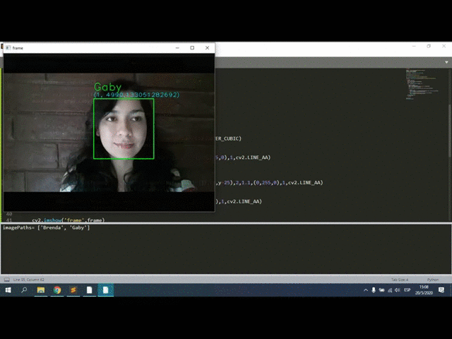

## 👩 Reconocimiento Facial 👨 | Python - OpenCV

En capturandoRostros.py vamos a capturar las personas que deseamos reconocer. En entrenandoRF.py entrenamos el reconocedor de rostros con:
EigenFaces, FisherFaces y LBPH. Finalmente podremos probar cada uno de los métodos (por separado) en ReconocimientoFacial.py

#EigenFaces

#FisherFaces

#LBPH

